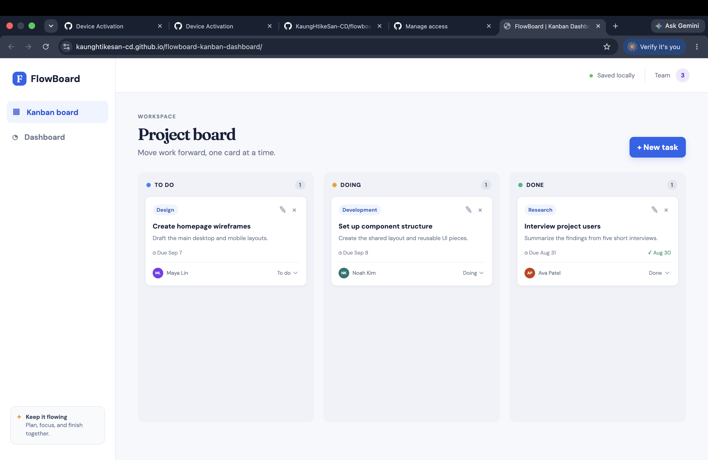
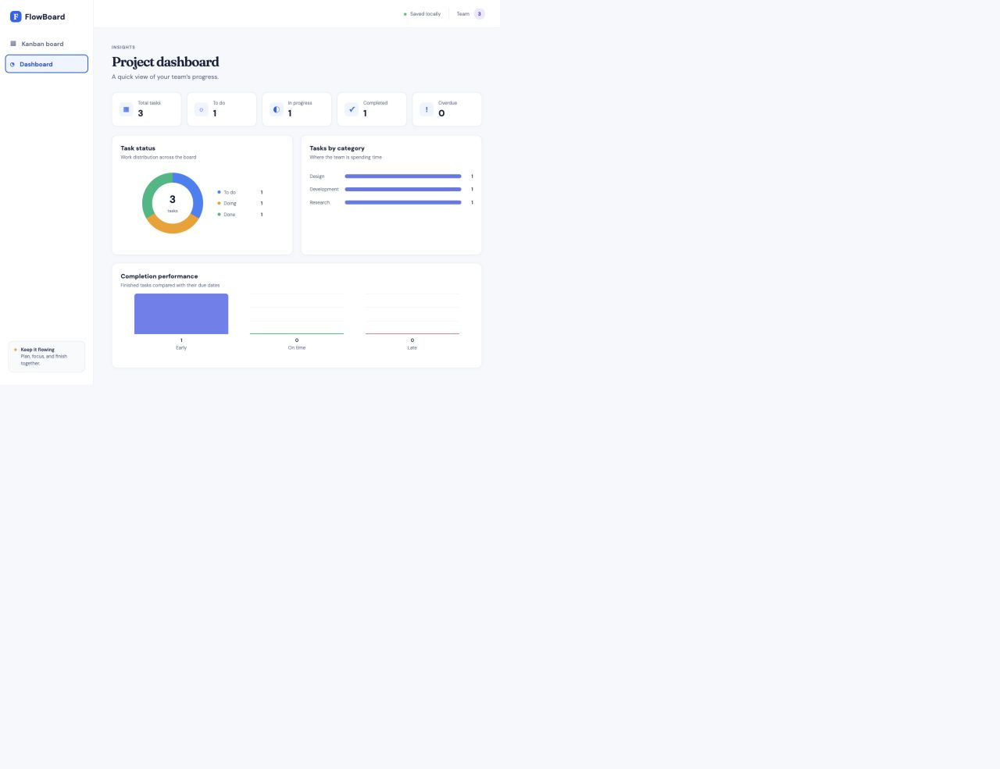

# FlowBoard

FlowBoard is a small Kanban board made with React. Our group made it to help a team keep track of tasks in three simple stages: **To Do**, **Doing**, and **Done**.

The project also has a dashboard page. It shows how many tasks are in each stage, how tasks are divided by category, and whether completed tasks were early, on time, or late.

We used Local Storage, so the tasks and categories are still there after refreshing the page. There is no backend or database.

## What you can do

- Add a task with a title, description, category, dates, and responsible person
- Edit or delete a task
- Move a task between To Do, Doing, and Done by dragging it or choosing a new status
- Add a new category when creating or editing a task
- See the completion date when a task is moved to Done
- Check the dashboard for task totals, overdue tasks, and charts

## Screenshots

| Kanban board | Dashboard |
| --- | --- |
|  |  |

## Group members

- Kaung Htike San
- Phyo Min Khaing
- Oak Soe Khant

## How to run the project

1. Download or clone this repository.
2. Open the project folder in a terminal.
3. Install the packages:

   ```bash
   npm install
   ```

4. Start the project:

   ```bash
   npm run dev
   ```

5. Open the local link shown in the terminal.

To make a production version, run:

```bash
npm run build
```

## GitHub Pages deployment

The project includes a GitHub Actions workflow for GitHub Pages. After it is pushed, open the repository settings, go to **Pages**, and choose **GitHub Actions** as the source. GitHub will build and publish the project automatically whenever `main` is updated.

## How we shared the work

We used separate branches so each member could make and push their own changes before merging them into `main`.

- Board layout and task movement
- Task form, categories, and Local Storage
- Dashboard, README, screenshots, and deployment
